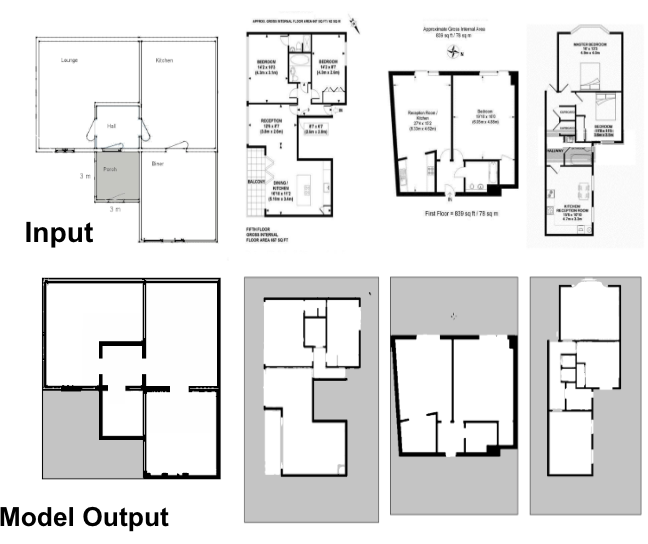
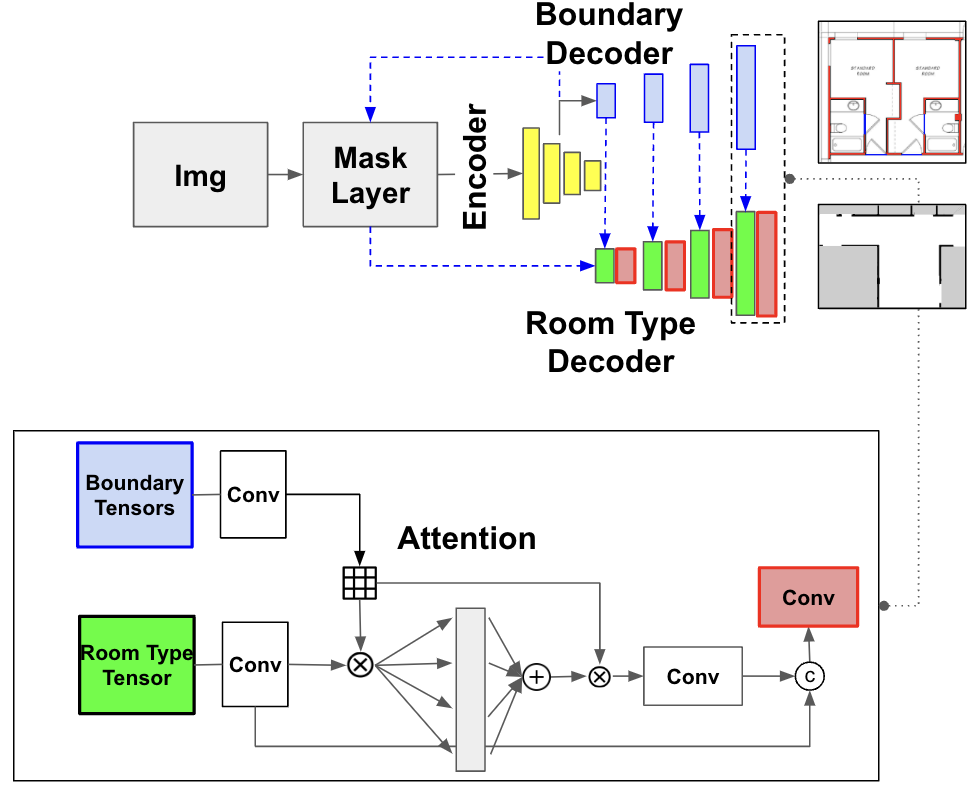
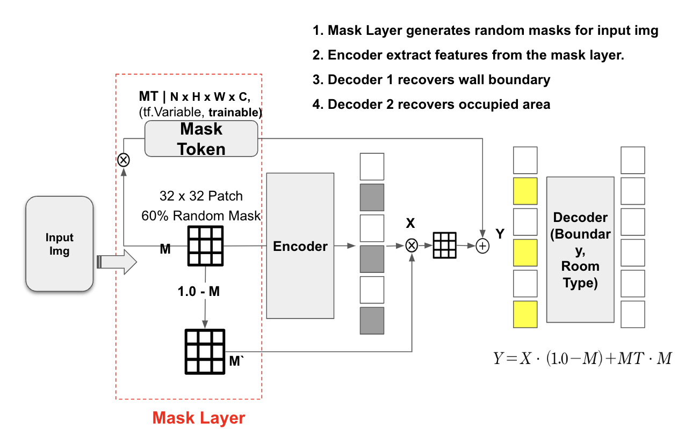
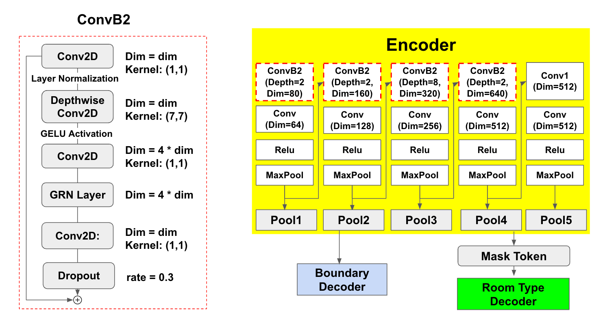
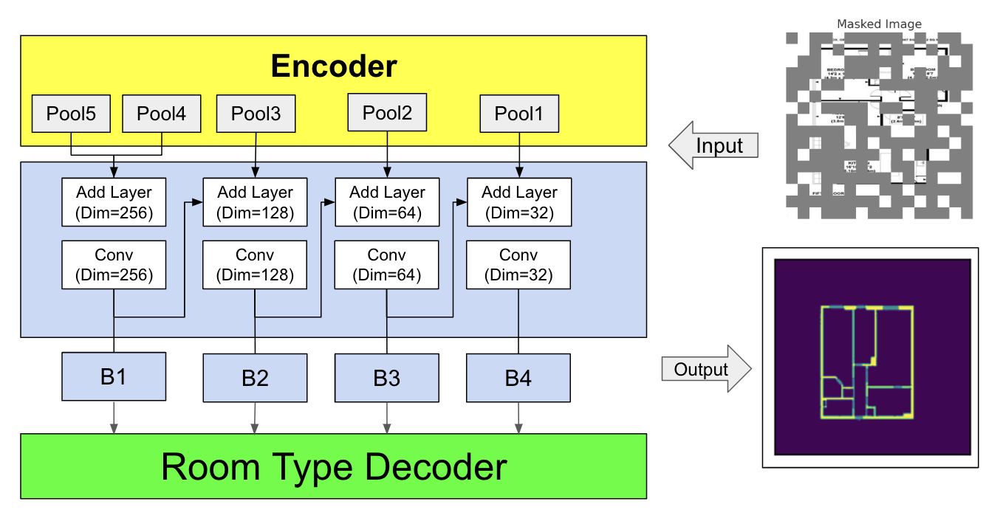
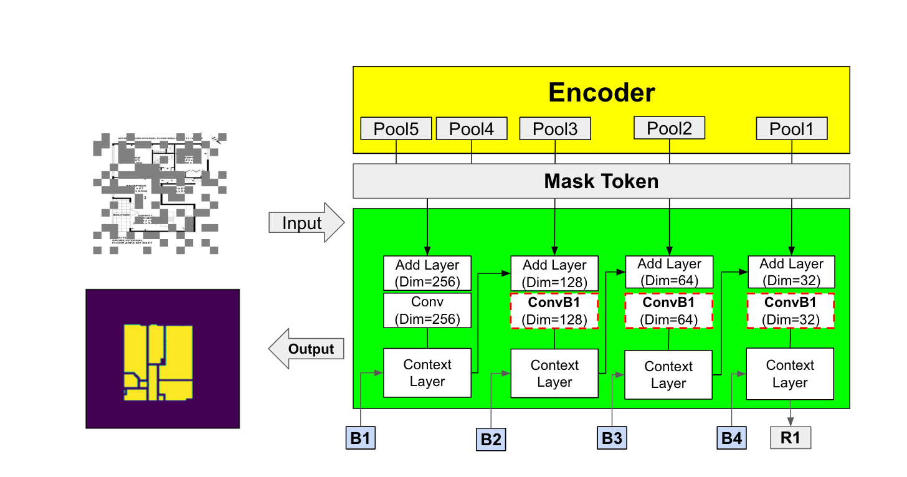
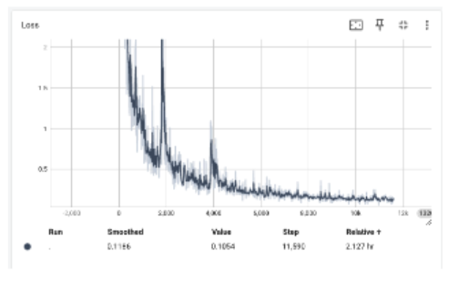
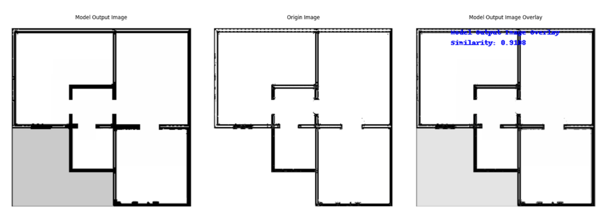
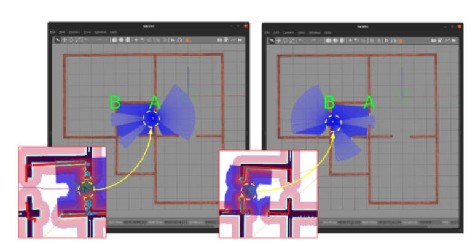

NOTE: The approach is inspired from [_Deep Floor Plan Recognition using a Multi-task Network with Room-boundary-Guided Attention_](https://github.com/zlzeng/DeepFloorplan) by zlzeng. I rewrite it from TF1 to TF2 and combine a [ConvNeXt-V2](https://github.com/facebookresearch/ConvNeXt-V2/tree/main) architecture to design a map generator.

The dataset is also downloaded from the zlzeng's github. 

# Introduction 

A deep learning-based approach to generate SLAM (Simultaneous Localization and Mapping) navigation maps for indoor autonomous mobile robots using building floor plans.  

The model leverages one encoder and two decoders and generates a map from the floor plan, suitable for a mobile robot navigation. 

Model Architecture is as follows. 

1. Masks are applied to input images during a training to enhance generalization and stability. 

    

2. Encoder. ConvB1 blocks are added on top of VGG encoder.

    

3. Decoders. ConvB2 blocks are added to Room Type VGG decoder. 

    
    
    > Boundary Decoder

    
    
    > Room Type Decoder

Note: The architecture is designed by combining [ConvNeXt-V2](https://github.com/facebookresearch/ConvNeXt-V2/tree/main) and [_Deep Floor Plan Recognition using a Multi-task Network with Room-boundary-Guided Attention_](https://github.com/zlzeng/DeepFloorplan). The ConvNextV2 is originally coded in pythorch, but i challenged to  interprete masking and layers in my own way, and write the code in Python, so that it may differ from the what it was inteded. 

# Test Environment 

| -             | -               |
|---------------|-----------------------|
| OS            | Linux Ubuntu 20.04    |
| CPU           | i5-8100               |
| GPU (Minimum) | GTX1050 Ti (4GB)      |
| RAM           | DDR4 8GB              |
| TensorFlow    | 2.13.0                |
| Python        | 3.1                   |
| ROS           | Foxy                  |
| cuDNN         | 8.6.0                 |
| Cuda          | 11.8                  |

However, I strongly recommend using high power GPU such as Nvidia RTX 3080 with high memory to save your mentality during training :) 

# Performance 

The table below shows the model's performance results after 100 epochs. The optimization was carried out using the Adam optimizer, and the learning rate was decreased by 0.9 every 1000 steps using Keras's ExponentialDecay technique.  
The metrics measured include spatial boundaries, spatial types, overlay, and loss values. 

| Metric            | Value                |
|-------------------|----------------------|
| Mean IoU CW       | 0.8053663372993469   |
| Mean IoU Room     | 0.9899017810821533   |
| overlay_cw_prt    | 0.8414320945739746   |
| overlay_r_prt     | 0.9891871809959412   |
| Loss Value        | 0.783219039440155    |

It demonstrate that the generated model accurately and efficiently recognizes and distinguishes boundaries and spatial types. The Mean IoU CW, representing spatial boundaries, and Mean IoU Room, representing spatial types, both show high values above 0.8, indicating the model's excellent performance in distinguishing various spatial types. The overlay_cw_prt and overlay_r_prt values, which represent the pixel match rate between the ground truth data and the predicted data, further indicate that the model generates navigation maps that reflect the real driving environment well. Overall, these values suggest that the proposed model exhibits high performance in generating navigation maps.

Additionally, the loss decreases steadily, indicating that the training is proceeding stably.

# Map Generation 

The output of the model replicates the same occupied areas, gray areas, and free spaces as traditional SLAD navigation maps. Also, I overlayed two images, see below, with original and model output, and it results in the same resolition. 

The image on the left shows the navigation map generated by the model, while the center image represents the utilized floor plan. The final overlay image illustrates that the resolution and structure of the generated navigation map match those of the actual floor plan, confirming the model's accuracy in generating consistent navigation maps.

# Experiment Setup and Results

For the experiment, a virtual environment measuring 12.5m x 13m was created using Gazebo's Building Editor. A TurtleBot3 was loaded into this environment and moved from point A to point B on the generated map.

